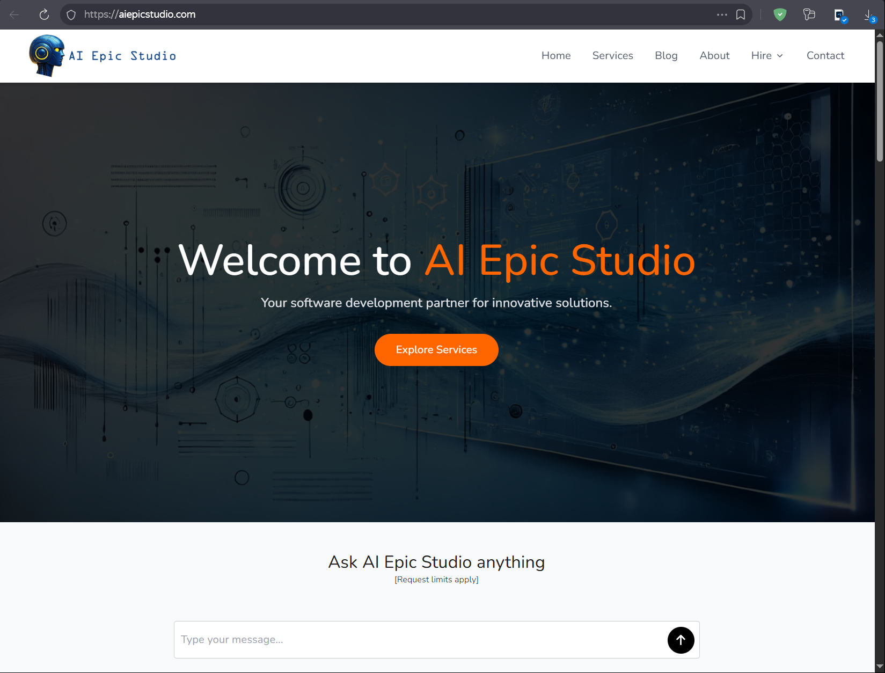
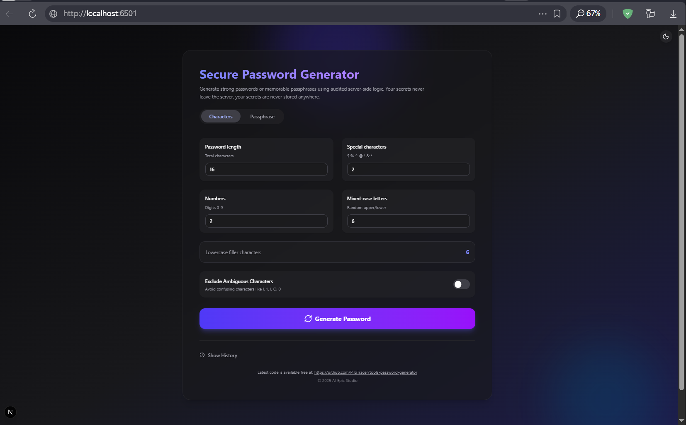
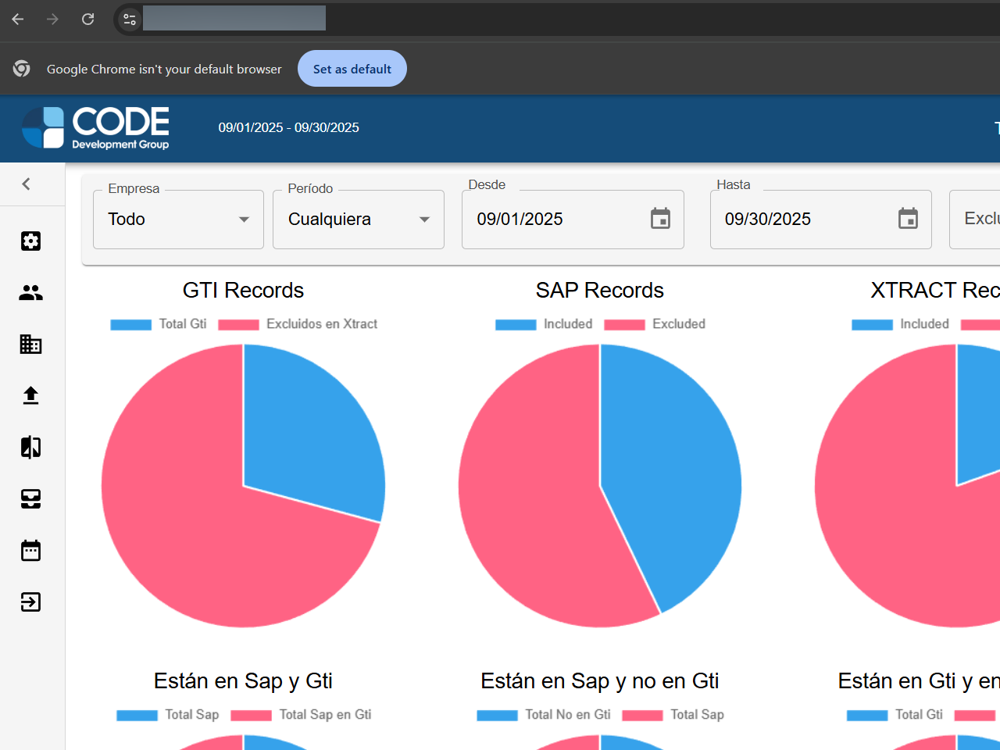
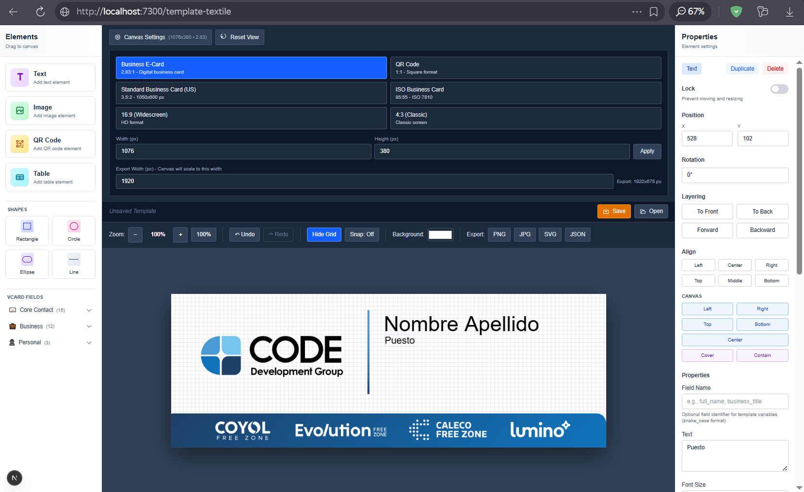

[](https://www.aiepicstudio.com)

**Main Website:** [https://www.aiepicstudio.com](https://www.aiepicstudio.com)  
AIEPIC Studio is the gateway for the studio's AI-enhanced creative work—showcasing immersive digital experiences, interactive storytelling, and innovation services that support client collaborations across design, software, and media.

# Project Portfolio Catalog

A curated collection of professional projects and tools developed for clients and personal use.

## 🌐 CODE Development Group Website
[](https://github.com/PiloTracer) [PRIVATE REPO]

- **Repository**: https://github.com/PiloTracer
- **Description**: Professional development courses and services designed to boost your career. From technical skills to leadership, we offer programs adapted to your needs. Connect with experts and transform your career!
- **Category**: Educational Platform
- **Technologies**: Web Development, Course Management

## 🔒 Secure Password Generator
[](https://github.com/PiloTracer/tools-password-generator)

- **Repository**: https://github.com/PiloTracer/tools-password-generator
- **Description**: A secure password generator that creates strong passwords or memorable passphrases using audited server-side logic. Your secrets never leave the server, your secrets are never stored anywhere.
- **Category**: Software y Herramientas
- **Key Features**:
  - Server-side password generation
  - Customizable character sets
  - Passphrase generation option
  - Exclude ambiguous characters
  - Password history tracking

## 📊 Corporate Dashboards
[](https://github.com/PiloTracer/tools-price-scraper)

[]

- **Repository**: https://github.com/PiloTracer/tools-price-scraper
- **Description**: Interactive business intelligence dashboards for data visualization and analysis. Features comprehensive metrics, pie charts, and filtering capabilities for business decision-making.
- **Category**: Data Analytics
- **Key Features**:
  - Custom date range filtering
  - Multi-company data comparison
  - Interactive pie charts
  - Record analysis and categorization

## 🃏 E-Card Template Generator
[](https://github.com/PiloTracer/tools-ecard)

- **Repository**: https://github.com/PiloTracer/tools-ecard
- **Description**: A modern, feature-centered web application for creating card templates and batch-generating personalized e-cards with QR codes. Replaces legacy C# WPF + Adobe InDesign pipeline.
- **Category**: Software y Herramientas
- **Key Features**:
  - Visual editor for card layouts
  - Text fields with auto-fit and multi-color styling
  - Dynamic image elements (icons, logos)
  - QR code generation
  - Background image uploads
  - Canvas-based rendering

## 🛠️ Development Environment Setup

All projects use a consistent development environment:

```bash
# Start development environment
docker-compose -f docker-compose.dev.yml up

# Services available at:
# - Frontend: http://localhost:3000
# - API Server: http://localhost:4000
# - PostgreSQL: localhost:5432
# - Cassandra: localhost:9042
# - Redis: localhost:6379
```

## 📦 Tech Stack

| Component | Technologies |
|-----------|--------------|
| **Frontend** | Next.js 16, React 19, Tailwind CSS, Fabric.js/Konva.js |
| **Backend** | Node.js 20+, TypeScript 5+, Fastify, Prisma |
| **Databases** | PostgreSQL 16, Cassandra 5, Redis 7 |
| **Specialized Tools** | BullMQ, node-canvas, Puppeteer, sharp |
